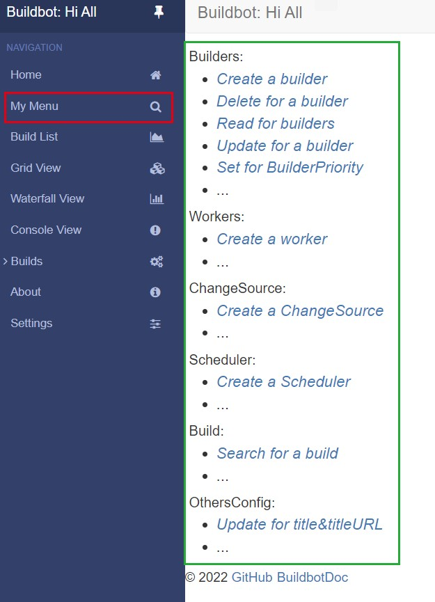
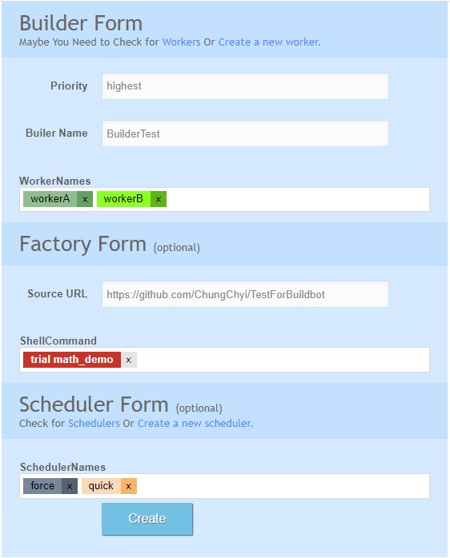

# Buildmaster for Buildbot
This is a buildmaster project.

# Install
Python version: 3.8.10  
Buildbot version: 3.5.0  
Twisted version: 22.4.0 

# Usage
This project is used to build a buildmaster.  
The most important file is master.cfg.
It contains all configuration information about buildmaster.

master.cfg: It loads the master configuration by reading configuration information from the database. 

myWebUI: Use the flask framework for web development. The html files are contained in the templates folder.

sql_buildbot.py: It contains the designed table object.

# Web UI

<!--  
  -->

This is a menu added to the Buildbot page, it supports some configuration operations, such as creating a builder, modifying a builder and adding workers, etc. Generally speaking, most of the operations are the prerequisites for creating a new Builder, which is the ultimate goal.

## the operation menu

## creating a builder

